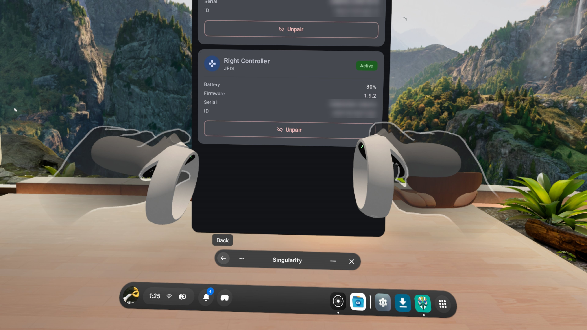

# Quest 2 Touch on Quest 3

[](LICENSE)

A Magisk module that lets Quest 2 Touch controllers pair and track on a Quest 3.

<p align="center">
  
</p>

## How It Works

The Quest 3 already supports Quest 2 controllers internally, but a few software checks block them. This module turns those checks off so the controllers can pair and track normally.

The full technical breakdown is in [WRITEUP.md](WRITEUP.md).

## Safety

- Your system files are never modified. Uninstalling the module returns the headset to stock.
- The installer checks your firmware first and refuses to install if it is not supported.
- The module turns itself off after a system update. Reinstall it to re-enable.

## Requirements

- Quest 3 rooted with Magisk
- Magisk OverlayFS (built into Singularity)

Quest 3S and other headsets are not tested, and therefore not supported officially.
If you have the capability to test this on a 3S or similar, you can fork this and attempt to get it working.

## Install

1. Download `q2touch_on_q3.zip` from [Releases](../../releases) and flash it in Magisk.
2. Reboot and pair your controllers.

To confirm it is working, run the command below. The output should start with `armed:`.

```bash
adb shell getprop debug.q2touch.state
```

## Known Issue: Rebooting

> [!WARNING]
> Before rebooting/during boot, unpair the controllers or take out their batteries.

Root is applied to the Quest 3 after it has already booted, either automatically with auto root enabled or manually through the Singularity app.

Until that happens, the module is not active. If the controllers try to connect during this time the headset's tracking service will keep crashing until Magisk applies the module. Reconnect the controllers once root is applied.

## Building From Source

Requires Android NDK r26 or newer.

```bash
./build.sh
```

## Disclaimer

This project is not affiliated with or endorsed by Meta. Use it at your own risk.

## License

Released under the [MIT License](LICENSE). Copyright (c) 2026 Axo ([@LiterallyAxo](https://github.com/LiterallyAxo)).

## AI Notice: 

AI assistance was used in the development of this project.
